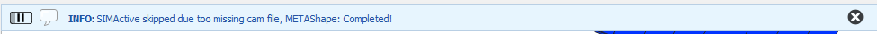
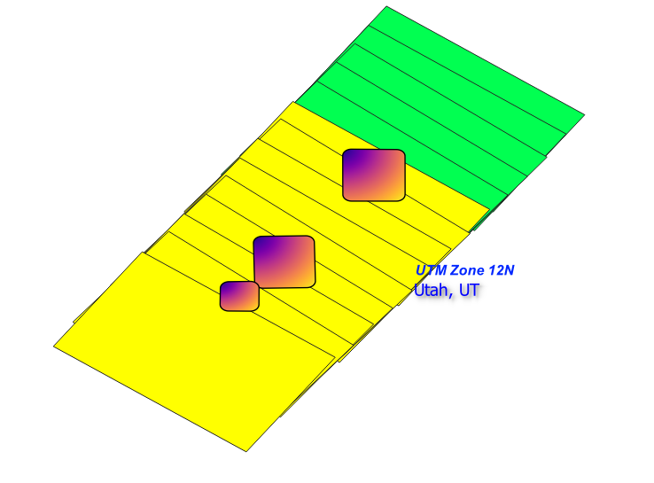

# AGI PINE Processing Plugin

This plugin is made to make starting a metashape orthorectification project a few clicks away. By selecting the photo footprints of the expected easements the program can start an orthorectification and post it to a processing machine.

## Install

The installation zip file is at `K:\Programs\AGI_qgis_Plugins\AGI_PINE_Processing_<version#>.zip`. To install the plugin you first need to ensure that the required dependencies are installed.

To install the needed dependencies open the ***OSGeo4W Shell*** and then run the command `pip install -r "K:\Programs\AGI_qgis_Plugins\Resources\AGI_PINE_Processing\requirements.txt"` or manually install the listed python libraries.

Once the dependencies are installed then open QGIS and from the top menubar **plugins>Manage and install plugins>Install from Zip** then select the zip and click install. The new plugin icon should now be available in the toolbar.

### Update

To update the plugin simply follow the same steps as for install and the plugin will be updated automatically, it may be necessary to close and reopen QGIS for the changes to take effect.

## Directions

To use first open a project with the easements for PINE. *(It is also recommended that the State and UTM zones are open for input use.)*

Once the plugin is open you will see a number of input fields. First set your EPSG value so that everything will load in the corect projection. If your data is in multiple EPSG sets you may have to open the data once for each EPSG that you wish to use.

Open the footprints by selecting the directory where the `.tif` files are located and select load. This will open a layer of image footprints for that directory. The .tif files must be named with **\<runid\>_\<exposure#\>.tif** or **<runid\>_\<exposure#\>_\<restofname\>.tif** in order to load in. Depending on the number of files in the directory and if the footprints have been generated yet or not this may take a few min.

Once the images load in you should see a Footprints group with your footprint layer inside.

The footprint shape file will have 6 types of classification.

1. Blue is a good footprint that is ready to be used.
2. Red is an image that failed QC for some reason and will not be used even if selected.
3. Light Blue is a Questionable footprint, this footprint can be used but the corresponding image should be manually checked first.
4. Purple is a footprint that is likely named incorrectly, has no/incorrect georefrence, or does not exist in the database, these images can not be used.
5. Green represents an image that has been used in an ortho process already. These can be used again but be cautious if they fully enclose an easement you wish to run.
6. Red Fade is a style that must be set manually by setting the attribute table **Status** value to 666. This marks the footprints as needing manual setup and or orthorectification. I have only ever needed this when more than one camera was used to cover an easement.

Next you will need to open the corresponding EO file for the images. The EO file needs to have the correct format to work correctly. The EO linker will let you format most EO files into a usable type.

If you do not see the Linker it may be colapsed.

To use it first select the original EO file most often found in the AT folder. Next select the directory where the footprint tif's are located to link the EO file to the images. Finally fill in the header and column values for the file. The default settings match most of the EO files but some will need manual input to work. The Header line must be at least 1 and is the line number of the column headers (it is sometimes necessary to remove anything between the header and the data for some files). The columns are 0 based so for the very first column the input number would be 0 then count up to the right.

On making the EO the file will be saved under the same name in the tif directory and automatically loaded into the project as points over the footprints. Only one EO file can be selected at a time in the **eo file** input. Only images that have points in that eo file can be used to start a process.

As seen above the selected eo only covers some of the footprints, so only those sections should be used until the other eo is loaded. It may be necessary to combine eo files to get an easement in some cases.

Once the eo is loaded you need to select the last few settings.

* The source DEM will be the DEM for the location you are working from the dropdown.
* **Cam Focal length** and **Cam Pixel Size** can almost always be left blank as the program will fill them in automatically but can be set if you wish to overide the database values.
* The **SIM cam** option can take a simactive cam file if you wish to generate a simactive setup but can be left blank most of the time.
* The **output folder** is the location that the setup files and metashape project will be created. I suggest this just be set to the same folder as the tif files.
* The **Send to Metashape** checkbox can be unselected if you wish to check that the generated files are correct or simply dont wish to run the process automatically. The linked dropdown lets you select the processing location. Keep in mind that some computers can not handle larger files and will crash if too large of an easement or too many images in one set is sent to them.

To start a process simply select the shape file for the footprints you want and then select the images you wish to use and hit start. It is best to keep the number of footprints selected as small as possible. If there is some overlap with another easement it is fine to select each individually as long as the selected images do not fully cover the other easement. If selecting one easement also covers another easement then you will need to select both easements simultaneously.

Send successful message:

Completed setup, no simactive message:

Process started:

## Selection Example

For the above selection you can see that I have selected only the middle easement. In this case the top most easement is fine as it is not fully covered by images that have been selected. However, the lower image is fully enclosed by the set I have selected, so it would be best to include it as well. I cant then run the last easement separately.

